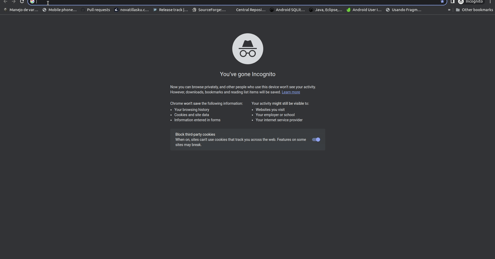

# adempiere-ui-gateway
A comprehensive Docker-based deployment system for ADempiere ERP with modular service profiles.

### Application Running

This project implements a Stack for ADempiere UI.

### General Explanation
This application consists of different containers that interact with each other to deliver the functionality of ADempiere.

The application downloads the required images for each container, runs the configured containers and restores the database if needed on your local machine **just by calling a script**!

It basically consists of a *docker compose* project that defines in a *docker-compose.yml* file all services needed to run ADempiere, Postgres, ZK, Vue and other services, all configurable with docker compose profiles.

A configuration file (_env_template.env_) defines all modifiable values (e.g. release versions, ports, container names etc.) to be used in the *docker-compose.yml* file; also a Docker Compose Profile defines the stack, i.e. the services to be used. Any combination of the services offered is possible with the help of Docker Compose "profiles".

When executed e.g. with the command _docker compose up_ or the shell script _start-all.sh_, the *docker compose* project eventually runs the services defined in *docker-compose.yml* file as Docker containers.
The running Docker containers comprise the application stack.

Due to the technology used, it is highly recommended to have a good knowledge of _docker_ and _docker compose_ to understand and work properly with this application. It is also useful to know how each container works.

### Benefits of the application
- In its simplest form, it can be used as a demo of the latest -or any desired- ADempiere version.
- No big installation hassle for getting it running: just execute the shell script **start-all.sh** .
- It can run on different hosts just by changing
  - the target IP to the one of the host or
  - the client name
- Completly configurable: any value can be changed for the whole application in the configuration file **env_template.env**.
- Single containers or images can be updated and/or replaced easily, making deployments and test speedy.
- Separations of concerns: every service implemets one and only one solution.
- The timezone and location for all containers are the same as the hosts'.
- Ideal for testing situations due to its ease of configuration and execution.
- No need of deep knowledge of ADempiere Installation, Application Server Installation, Docker, Images or Postgres.
- Every container, image and object is unique, derived from a configuration file.
- New services can be easily added.

### Table of Contents
Please follow the links for detaile information.

- [Quick Start](docs/quickstart.md)
- [Architecture](docs/architecture.md)
- [Profiles](docs/profiles.md)
- [Installation](docs/installation.md)
- [Display Services](docs/services.md)
- [Security Information](docs/security.md)
- [Debugging](docs/debugging.md)
- [Additional Info](docs/additional_info.md)
- [License](./LICENSE)
