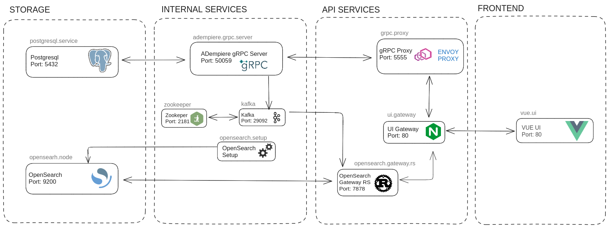

# adempiere-ui-gateway
This project implements a Default Gateway for ADempiere UI

This API Gateway offers an *ADempiere User Interface Gateway Definition*.

The main scope for this project is gRPC [transcoding](https://cloud.google.com/endpoints/docs/grpc/transcoding).

See [this article](https://www.nginx.com/blog/deploying-nginx-plus-as-an-api-gateway-part-1/) for more info.

This application downloads the required images, runs the configured containers and restores the database if needed on your local machine **just by calling a script**!

It consists of a *docker compose* project that defines all services needed to run ADempiere, ZK, Vue and other services. 

When executed, the *docker compose* project eventually runs the services defined in *docker-compose files* as Docker containers.
The running Docker containers comprise the application.
There are several docker compose files that start different services, according to the needs.

### Benefits of the application:
- In its simplest form, it can be used as a demo of the latest -or any- ADempiere version.
- No big installation hassle for getting it running: just execute the shell script **start-all.sh** .
- It can run on different hosts just by changing
  - the target IP to the one of the host or
  - the client name
- Completly configurable: any value can be changed for the whole application at the single configuration file **env_template.env**.
- Single containers or images can be updated and/or replaced easily, making deployments and test speedy.
- The timezone and location for all containers are the same as the hosts'.
- Ideal for testing situations due to its ease of configuration and execution.
- No need of deep knowledge of ADempiere Installation, Application Server Installation, Docker, Images or Postgres.
- Every container, image and object is unique, derived from a configuration file.
- New services can be easily added.
- `In future:` It can be executed concurrently for different customers on the same host by just changing the project name and running anew.
- [API Key Authentication](https://docs.nginx.com/nginx/deployment-guides/single-sign-on/keycloak/)
- [Transformation using Lua](https://clouddocs.f5.com/training/community/nginx/html/class3/module1/module16.html)
- [Transformation using Javascript](https://clouddocs.f5.com/training/community/nginx/html/class3/module1/module16.html)
- [Content Caching](https://docs.nginx.com/nginx/admin-guide/content-cache/content-caching/#:~:text=Overview,the%20same%20content%20every%20time.)

### Example of Application Running


## General Explanations
### User's perspective
From a user's point of view, the application consists of the following.
Take note that the ports are defined in file *env_template.env* as external ports and can be changed if needed or desired.
- A home web site accesible via port **8080**
  From which all applications can be called
- An ADempiere ZK UI accesible via port **8888**
- An ADempiere Vue UI accesible via port **8891**
- A Postgres databasee accesible e.g. by PGAdmin via port **55432**

### Application Stack
The application stack consists of the following services defined in the *docker-compose files* (and retrieved on the console with **docker compose ls**); these services will eventually run as containers:
- **adempiere-site**: defines the landing page (web site) for this application
- **postgresql.service**: defines the Postgres database
- **adempiere-zk**: defines the Jetty server and the ADempiere ZK UI
- **adempiere-grpc-server**: Defines a grpc server as the backend server for Vue
- **adempiere.processor**: for processes that are executed outside Adempiere
- **dkron.scheduler**: a scheduler
- **grpc.proxy**: an envoy server
- **vue-ui**: defines ADempiere Vue UI
- **opensearch.node**: stores the Application Dictionary definitions
- **opensearch.setup**: configure the service *opensearch.node*
- **zookeeper**: controller for *kafka* service
- **kafka**: messaging and streaming
- **opensearch.gateway.rs**:
- **keycloak**: user management on service *postgresql.service*
- **ui.gateway**:
- **s3.storage**: for attachments
- **s3.client**: configuration of "s3-storage" service
- **s3.gateway.rs**:

Additional objects defined in the *docker-compose files*:
- `adempiere_network`: defines the subnet used in the involved Docker containers (e.g. **192.168.100.0/24**)
- `volume_postgres`: defines the mounting point of the Postgres database (typically directory **/var/lib/postgresql/data**) to a local directory on the host where the Docker container runs. This implement a persistent database.
- `volume_backups`: defines the mounting point for a backup (or restore) directory on the Docker container to a local directrory on the host where the Docker container has access.
- `volume_persistent_files`: mounting point for the ZK container
- `volume_scheduler`: defines the mounting point for the scheduler (`TO BE IMPLEMENTED YET`)

### Architecture
- The application `vue` stack as graphic:


- The application `storage` stack as graphic:


- The application `storage` stack as graphic:


### File Structure
- *README.md*: this very file
- *env_template.env*: template for definition of all variables used in docker composed files.  
Usually, this file is edited for testing and copied to *.env* before running docker compose.
- *.env*: definition of all variables used in *docker-compose files*.
- *docker compose service files*: there are several of them; each of these files define a service only.  
It may exist more than one docker compose service file for every service (see [all docker compose service files](https://github.com/Systemhaus-Westfalia/adempiere-ui-gateway/tree/feature/flexible_services_definition/docker-compose)). This may be the case when a service is used in different configurations for different purposes/modes.  

  The combination of several of these docker compose service files implements the services needed for a special purpose/mode (as of now: *auth*, *cache*, *develop*, *storage*, *vue*, *default*).  
  The definition of one service in a single file permits reutilization and the combination of existing services to new purposes/modes for which hitherto a new docker-compose file was needed. Also, as one service version is only defined once, possible repetitions and small unwanted different definitions in docker-compose files are avoided.  
  See explanation of `start-all.sh` to understand how these files are used.  

  Example of docker compose service files are:
  - **01a-postgres_service_with_ports.yml**: one implementation of postgres service.
  - **01b-postgres_service_without_ports.yml**: another implementation of postgres service.
  - **02a-s3_storage_service.yml**: implementation of s3 storage service.
  - **03a-s3_client_service.yml**: implementation of s3 client service.
  - **04a-s3_gateway_rs_service_develop.yml**: one implementation of s3 gateway rs service.
  - **04b-s3_gateway_rs_service_standard.yml**: another implementation of s3 gateway rs service.
  - **05a-adempiere_site_service.yml**: implementation of home site service.
  - **06a-adempiere_zk_service.yml**: implementation of ZK service.
  - **07a-adempiere_processor_service.yml**: implementation of processor service.
  - **08a-dkron_scheduler_service.yml**: implementation of dkron service.
  - **09a-adempiere_grpc_server_service.yml**: implementation of grpc service.
  - **10b-grpc_proxy_service_develop.yml**: other implementation of grpc proxy service.
  - **10c-grpc_proxy_service_standard.yml**: other implementation of grpc proxy service.
  - **10d-grpc_proxy_service_vue.yml**: yet other implementation of grpc proxy service.
  - **11a-vue_ui_service.yml**: implementation of Vue service.
  - **and more**: see [all docker compose service files](https://github.com/Systemhaus-Westfalia/adempiere-ui-gateway/tree/feature/flexible_services_definition/docker-compose).
- *docker-compose legacy files*: initial way the services were implemented. Here all services are defined in one file.
  Variables used in these files are taken from file *.env*.  
**These files are now legacy**, i.e. they were the first attempt, but -due to more flexibility, reusability and scalability- the *docker compose service files*are now implemented (see preceeding section).  

  As of now, the existing docker compose legacy files are the following:
  - **docker-compose-standard.yml**: the default; when no other file is pecified, this file is taken.
  - **docker-compose-auth.yml**: complete Stack with Open-ID authentication
    Includes a keycloak service and allows its usage as SSO service connecting ADempiere by Open-ID
  - **docker-compose-cache.yml**:
  - **docker-compose-develop.yml**: services for development, for example with ports exposed
  - **docker-compose-storage.yml**
  - **docker-compose-vue.yml**: for vue minimal stack services  

  Eventually, as the *docker compose service files* will be updated and improved, the *docker compose legacy files* will divert from the actual functionality. That is why is not recommended to work with the *docker compose legacy files* anymore. They are useful when while testing the new *docker compose service files* some discrepancies/errors pop up and one wants to compare behavior.
- `start-all.sh`: shell script to create and eventually automatically execute docker compose.  

  This bash script must be called with the docker-compose flag **-d** + one of the following parameters [**auth**, **cache**, **develop**, **storage**, **vue**, **default**].  
It can also be called with the legacy flag  **-l** (this is only legacy and not intended to be continued).  

  First of all, the persistent directory (database) and the backup directory are created if not existent; then the file *env_template.env* is copied to *.env* and eventually Docker Compose is started for the file `docker-compose.yml`.

  Depending on the parameters, Docker Compose is executed for the eventually assembled `docker-compose.yml` file.

  Here, some examples of how the parameters work:
    - **./start-all.sh** (default behavior without parameters)
      If the script is called without a flag, the 'standard' purpose/mode will be taken and also no legacy assumed (i.e. the docker compose service files for "standard" will be used to assemble the file `docker-compose.yml`).
    - **./start-all.sh -l** (default behavior, with legacy)
      If the script is called only with a *-l* flag, the 'standard' purpose/mode will be taken and also legacy assumed. The file `docker-compose-standard.yml` will be copied to `docker-compose.yml`, and docker compose will be executed with this file.
    - **./start-all.sh -d auth**
      The services combination for Auth will be assembled and copied to file `docker-compose.yml` by using the corresponding docker compose service files, and docker compose will be executed with the file `docker-compose.yml`.
    - **./start-all.sh -d vue**
      The services combination for Vue will be assembled and copied to file `docker-compose.yml` by using the corresponding docker compose service files, and docker compose will be executed with the file `docker-compose.yml`.
    - **./start-all.sh -d cache**
      The services combination for Cache will be assembled and copied to file `docker-compose.yml` by using the corresponding docker compose service files, and docker compose will be executed with the file `docker-compose.yml`.
    - **./start-all.sh -d vue -l**
      (legacy behavior) The file `docker-compose-vue.yml` will be copied to `docker-compose.yml`, and docker compose will be executed with this file.
    - **./start-all.sh -d cache -l**
      (legacy behavior) The file `docker-compose-cache.yml` will be copied to `docker-compose.yml`, and docker compose will be executed with this file.

    In the end, a file named **docker-compose.yml** will always be created depending on the parameters passed, and docker compose will be executed with this file.
    The file **docker-compose.yml** will be used only for the duration of the docker compose cycle.  
    It will be deleted when `stop-all.sh` is executed
- `stop-all.sh`: shell script to automatically stop all services that were started with the script `start-all.sh` and defined in file `docker-compose.yml`.
  The file `docker-compose.yml` is deleted after stopping all services.
- `stop-and-delete-all.sh`: shell script to delete **all** containers, images, networks, cache and volumes, **including the ones** created without `start-all.sh` or by executing `docker-compose.yml`. 
**Be very careful when using this script, because it will reset everything you have of Docker**.

    After executing this shell, no trace of the application will be left over. Only the persistent directory will not be affected, which must be manually deleted if desired.  
The file `docker-compose.yml` is deleted after stopping and deleting all objects.
- `postgresql/Dockerfile`: the Dockerfile used.
  It mainly copies `postgresql/initdb.sh` to the container, so it can be executed at start.
- `postgresql/initdb.sh`: shell script executed when Postgres starts.
  If there is a database named `adempiere`, nothing happens.
  If there is no database named `adempiere`, the script checks if there is a database seed file in the backups directory.
  - If there is one, it launches a restore database.
  - If there is none, the latest ADempiere seed is downloaded from Github and the restore is started with it.
- `postgresql/postgres_database`: directory on host used as the mounting point for the Postgres container's database.
  This makes sure that the database is not deleted even if the docker containers, docker images and even docker are deleted.
  The database contents are kept always persistently on the host.
- `postgresql/backups`: directory on host used as the mounting point for the `backups/restores` from the Postgres container.
  Here the seed file for a potential restore can be copied.

  The name of the seed can be defined in `env_template.env`.
  The seed is a backup file created with psql.
  If there is a seed, but a database exists already, there will be no restore.  

  This directory may also be useful when creating a backup: it can be created here, without needing to transfer it from the container to the host.
- `postgresql/persistent_files`: directory on host used for persistency with the ZK container. It allows to share files bewteen the host and the ZK container.
- *docs*: directory containing images and documents used in this README file.

## Installation
### Requirements
##### 1 Install Tools
Make sure to install the following:
- JDK  11
- Docker
- Docker compose: [Docker Compose v2.16.0 or later](https://docs.docker.com/compose/install/linux/)
- Git

##### 2 Check versions
2.1 Check `java version`
```Shell
java --version
    openjdk 11.0.11 2021-04-20
    OpenJDK Runtime Environment AdoptOpenJDK-11.0.11+9 (build 11.0.11+9)
    OpenJDK 64-Bit Server VM AdoptOpenJDK-11.0.11+9 (build 11.0.11+9, mixed mode
```
2.2 Check `docker version`
```Shell
docker --version
    Docker version 23.0.3, build 3e7cbfd
```
2.3 Check `docker compose version`
```Shell
docker compose version
    Docker Compose version v2.17.2
```
### Clone This Repository
```Shell
git clone https://github.com/adempiere/adempiere-ui-gateway
cd adempiere-ui-gateway
```
### Make sure to use correct branch
```Shell
git checkout main
```

### Automatic Execution

##### 1 Execute With One Script
Execute script `start-all.sh -d [auth, cache, develop, storage, vue, default]`:

```shell
cd adempiere-ui-gateway/docker-compose
```

- Auth stack:
```shell
./start-all.sh -d auth
```

- Cache stack:
```shell
./start-all.sh -d cache
```

- Develop stack:
```shell
./start-all.sh -d develop
```

- Storage stack:
```shell
./start-all.sh -d storage
```

- Vue stack:
```shell
./start-all.sh -d vue
```

- Default (Standard) stack:
```shell
./start-all.sh -d default
```
Or without arguments
```shell
./start-all.sh -d
```

The script `start-all.sh` carries out the steps of the automatic installation.

Depending on the parameter following the `-d` flag, the script assembles the file **docker-compose.yml** by appending the contents of the corresponding docker compose service files; it then calls docker compose with it (`docker compose -f docker-compose.yml`).

If no flag and/or parameter is given, the call will default to `docker compose -f docker-compose.yml` for the services combination **standard**.  
If directories `postgresql/postgres_database` and `postgresql/backups` do not exist, they are created.

**Legacy** (flag `-l`)
Execute script `start-all.sh -d  [auth, cache, develop, storage, vue, default] -l`:

```shell
cd adempiere-ui-gateway/docker-compose
```

- Auth stack:
```shell
./start-all.sh -d auth -l
```

- Cache stack:
```shell
./start-all.sh -d cache -l
```

- Develop stack:
```shell
./start-all.sh -d develop -l
```

- Storage stack:
```shell
./start-all.sh -d storage -l
```

- Vue stack:
```shell
./start-all.sh -d vue -l
```

- Default (Standard) stack:
```shell
./start-all.sh -d default -l
```
Or without arguments
```shell
./start-all.sh -d -l
```

For legacy, the script `start-all.sh` copies the corresponding docker-compose file (one of `docker-compose-auth.yml`, `docker-compose-cache.yml`, `docker-compose-vue.yml`, etc.) to **docker-compose.yml**.  
Then, docker compose is executed on this file.

##### 2 Result Of Script Execution
Whatever parameters are passed when calling `./start-all.sh`, decker compose is always called as follows: `docker compose -f docker-compose.yml`.

  Depending on the parameters passed, the file `docker-compose.yml` will define several services in the desired order. Which docker compose service files are used depends on the purpose/mode: for example when testing Vue, the combination is different than for Authentication.

  All images are downloaded, containers and other docker objects created, containers are started, and -depending on conditions explained in the following section- database restored.

This might take some time, depending on your bandwith and the size of the restore file.

##### 3 Cases When Database Will Be Restored
If
- there is a file *seed.backup* (or as defined in `env_template.env`, variable `POSTGRES_RESTORE_FILE_NAME`) in directory `postgresql/backups`, and
- the database as specified in `env_template.env`, variable `POSTGRES_DATABASE_NAME` does not exist in Postgres, and
- directory `postgresql/postgres_database` has no contents

*The database  will be restored*.

##### 4 Cases When Database Will Not Be Restored
The execution of `postgresql/initdb.sh` will be skipped if
- directory `postgresql/postgres_database` has contents, or
- in file `docker-compose.yml` there is a definition for *image*.
  Here, the Dockerfile is ignored and thus also `docker-compose.yml`.


## Open Applications
- Project site: open browser and type in the following url [http://localhost:8080](http://localhost:8080)
  http://0.0.0.0/
  Or use IP as defined in configuration file (env_template.env or .env) in variables HOST_URL, ADEMPIERE_SITE_EXTERNAL_PORT
  From here, the user can navigate via buttons to ZK UI, Vue UI or Envoy browser.
- Open separately Adempiere ZK: open browser and type in the following url
  - [${HOST_URL}/webui](${HOST_URL}/webui)
  HOST_URL as defined in configuration file (env_template.env or .env)
  - [http://localhost:8888/webui](http://localhost:8888/webui)
  Or use IP as defined in configuration file (env_template.env or .env) in variables HOST_URL, ADEMPIERE_ZK_EXTERNAL_PORT
  (`TO BE VERIFIED YET`)
- Open separately Adempiere Vue: open browser and type in the following url
  - [${HOST_URL}/vue](${HOST_URL}/vue)
  HOST_URL as defined in configuration file (env_template.env or .env)
- Open separately Envoy:  (`TO BE IMPLEMENTED YET`)


### Manual Execution
Alternative to **Automatic Execution**.
Recommendable for the first installation.
##### 1 Create the directory on the host where the database will be mounted
```shell
mkdir postgresql/postgres_database
```
##### 2 Create the directory on the host where the backups will be mounted
```shell
mkdir postgresql/backups
```
##### 3 Copy backup file (if restore is needed)
- If you are executing this project for the first time or you want to restore the database, execute a database backup e.g.:
`pg_dump -v --no-owner -h localhost -U postgres <DB-NAME> > adempiere-$(date '+%Y-%m-%d').backup`.
- The file must be named `seed.backup` or as it was defined in *env_template.env*, variable `POSTGRES_RESTORE_FILE_NAME`.
  Then, copy or move it to `adempiere-all-service/postgresql/backups`.
- Make sure it is not the compressed backup (e.g. .jar).
- The database directory `adempiere-all-service/postgresql/postgres_database` must be empty for the restore to ocurr.
  A backup will not ocurr if the database directory has contents.
```shell
cp <PATH-TO-BACKUP-FILE> postgresql/backups
```
##### 5 Modify env_template.env as needed
The only variables actually needed to change are
- `COMPOSE_PROJECT_NAME` -> to the name you want to give the project, e.g. the name of your client.
  From this name, all images and container names are derived.
- `HOST_IP` -> to to the IP your host has.
- `POSTGRES_IMAGE` -> to the Postgres version you want to use.
- `ADEMPIERE_GITHUB_VERSION` -> to the DB version needed.
- `ADEMPIERE_GITHUB_COMPRESSED_FILE` -> to the DB version needed.


Other values in *env_template.env* are default values.
Feel free to change them accordingly to your wishes/purposes.
There should be no need to change file `docker-compose.yml`.

##### 6 Copy env_template.env if it was modified
Once you modified *env_template.env* as needed, copy it to `.env`. This is not needed if you run `start-all.sh`.
```shell
cp env_template.env .env
```

##### 7 File initdb.sh (optional)
Modify `postgresql/initdb.sh` as necessary, depending on what you may want to do at database first start.
You may create roles, schemas, etc.

##### 8 Execute docker compose
Run `docker compose`
```shell
cd adempiere-ui-gateway/docker-compose
docker compose -f <filename> up -d
```

**Result: all images are downloaded, containers and other docker objects created, containers are started, and database restored**.

This might take some time, depending on your bandwith and the size of the restore file.

### Stop All Services That Were Started With Script start-all.sh
To stop all Docker containers that were started with script `start-all.sh`, just execute:
```Shell
cd adempiere-ui-gateway/docker-compose
./stop-all.sh
```
The file `docker-compose.yml` - created with script `start-all.sh` - contains the services tobe stopped.
The file `docker-compose.yml` is deleted after stopping all services.

### Delete All Docker Objects
Sometimes, due to different reasons, you need to undo everything you have created on Docker and start anew. This is mostly in development, not in production.
Then:
- All Docker containers must be shut down.
- All Docker containers must be deleted.
- All Docker images must be deleted.
- The Docker installation cache must be cleared.
- All Docker networks and volumes must be deleted.

Execute script:
```Shell
cd adempiere-ui-gateway/docker-compose
./stop-and-delete-all.sh
```
**Be very careful when using this script, because it will delete all Docker objects you have!**

### Database Access
Connect to database via port **55432** with a DB connector, e.g. PGAdmin.
Or to the port the variable `POSTGRES_EXTERNAL_PORT` points in file `env_template.env`.

## Useful Commands
This application uses **Docker Compose** and as such, all docker and docker compose commands can be called to work wit it.
### Container Management
##### Shut Down All Containers
  All containers started with the -f flag file will be stopped and destroyed; the database will be preserved.
  All docker images, networks, and volumes will be preserved.
```Shell
docker compose  -f <filename> down
```
##### Stop aAd Delete One Service (services defined in *docker-compose* files)
```Shell
docker compose rm -s -f <service name>
docker compose rm -s -f postgresql.service
docker compose rm -s -f adempiere-zk
etc.
```
##### Stop And Delete All Services
```Shell
docker compose rm -s -f
```
##### Create And Restart All Services
```Shell
docker compose  -f <filename> up -d
```
##### Stop One Single Service
```Shell
docker compose stop <service name>
docker compose stop adempiere-site
etc.
```
##### Start One Single Service (after it was stopped)
```Shell
docker compose start <service name>
docker compose start adempiere-site
etc.
```
##### Start And Stop One Single Service
```Shell
docker compose restart <service name>
docker compose restart adempiere-site
etc.
```
##### Find Containers And Services
```Shell
docker compose ps -a
```

### Misc Commands
##### Display All Docker Images
```Shell
docker images -a
```

##### Display All Docker Containers
```Shell
docker ps -a
docker ps -a --format "{{.ID}}: {{.Names}}"
```

##### Debug I: Display Values To Be Used In Application
Renders the actual data model to be applied on the Docker engine by merging `env_template.env` and `docker-compose.yml`.
If you have modified *env_template.env*, make sure to copy it to `.env`.

```shell
cp env_template.env .env
docker compose convert
```

##### Debug II: Display Container Logs
```shell
docker container logs <CONTAINER>                         -->> variable defined in *env_template.env*
docker container logs <CONTAINER> | less                  -->> variable defined in *env_template.env*
docker container logs adempiere-all.postgres
docker container logs adempiere-all.postgres | less

```

##### Debug III: Display Container Values
Display the values a container is working with.
```Shell
docker container inspect <CONTAINER>
docker container inspect adempiere-all.postgres
docker container inspect adempiere-all.zk
etc.

```

##### Debug IV: Log Into Container
```Shell
docker container exec -it <CONTAINER> <COMMAND>
docker container exec -it adempiere-all.postgres bash
etc.

```

##### Delete Database On Host I (Using Docker File System)
Physically delete database from the host via Docker elements.
Sometimes it is needed to delete all files that comprises the database.
Be careful with these commands, once done, there is no way to undo it!
The database directory must be empty for the restore to work.
```Shell
sudo ls -al /var/lib/docker/volumes/<POSTGRES_VOLUME>              -->> variable defined in *env_template.env*
sudo ls -al /var/lib/docker/volumes/adempiere-all.volume_postgres  -->> default value

sudo rm -rf /var/lib/docker/volumes/<POSTGRES_VOLUME>/_data
sudo rm -rf /var/lib/docker/volumes/adempiere-all.volume_postgres/_data
```

##### Delete Databse On Host II (using mounted volume on host)
Physically delete database from the host via mounted volumes.
Sometimes it is needed to delete all files that comprises the database.
Be careful with these commands, once done, there is no way to undo it!
The database directory must be empty for the restore to work.
```Shell
sudo ls -al <POSTGRES_DB_PATH_ON_HOST>                         -->> variable defined in *env_template.env*
sudo ls -al <PATH TO REPOSITORY>/postgresql/postgres_database  -->> default value

sudo rm -rf <POSTGRES_DB_PATH_ON_HOST>
sudo rm -rf <PATH TO REPOSITORY>/postgresql/postgres_database
```


## Additional Info

This service just exposes the port `80`. You should configure to use `api.adempiere.io` (for linux just add this domain to `/etc/hosts`).
Or: change the variable HOST_IP in file env_template.env and .env.

The main service responding to all request a `nginx`.

```
nano /etc/hosts
127.0.0.1       localhost
127.0.1.1       adempiere
<Your-IP-Here>      api.adempiere.io

```

### Request using transcoding

This request use the `nginx` + `envoy` + `adempiere-grpc-server` using [transcoding](https://cloud.google.com/endpoints/docs/grpc/transcoding).

The base URL is `/api/`

**Example Request**

```Shell
curl --location 'http://api.adempiere.io/api/security/services'
```

**Response**
```json
{
    "services": []
}
```

### Request using legacy node server

This request use the `nginx` + `proxy-adempierer-api` using default `http`

The base URL is `/api/`

**Example Request**

```Shell
curl --location 'http://api.adempiere.io/api/user/open-id/services'
```

**Response**
```json
{
    "code": 200,
    "result": []
}
```

Error response format
```json
{
    "code": 1,
    "message": "",
    "deatils": []
}
```
