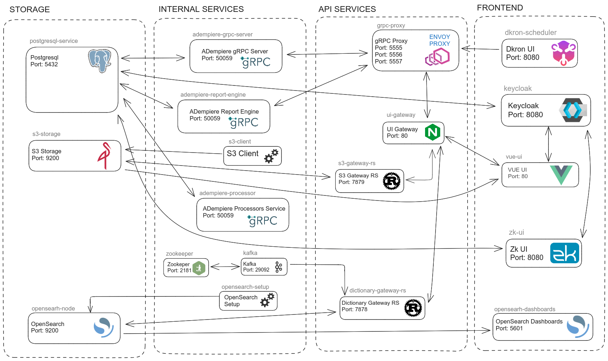

## Architecture

### Services of Application Stack


The services that can be executed are:
 - adempiere-site
 - adempiere-zk
 - vue-ui
 - adempiere-grpc-server
 - postgresql-service
 - ui-gateway
 - adempiere-processor
 - dkron-scheduler
 - adempiere-report-engine
 - s3-storage
 - s3-client
 - s3-gateway-rs
 - grpc-proxy
 - kafka
 - kafdrop
 - opensearch-node
 - opensearch-setup
 - opensearch-dashboards
 - dictionary-rs
 - keycloak
 - zookeeper


### Quick Description of Application Stack
The application stack consists of the following services defined in the *docker-compose.yml* file (and retrieved on the console with **sudo docker compose ls**); these services will eventually run as containers:
- **adempiere-site**: Defines the landing page (web site) for this application. It can be implemented as wished.
- **adempiere-zk**: Defines the Jetty server and the ADempiere ZK UI.
- **vue-ui**: Defines the new ADempiere UI with Vue.
- **adempiere-grpc-server**: Dedicated gRPC backend server for Vue UI. Implements the ADempiere business logic (POS, invoicing, inventory, etc.) and communicates with the database.
- **postgresql-service**: Defines the Postgres database, that is persistently implemented on the host.
- **ui-gateway**: Unique access point acting as a reverse proxy and routing to redirect multiple services.
- **adempiere-processor**: For processes that are executed outside Adempiere.
- **dkron-scheduler**: A scheduler for these processes.
- **adempiere-report-engine**: For reports.
- **s3-storage**: S3 (Simple Storage Service) for attachments and files.
- **s3-client**: S3 (Simple Storage Service) default access configuration.
- **s3-gateway-rs**: S3 (Simple Storage Service) API RESTful between ui-gateway and implemented S3 to manage files with client.
- **grpc-proxy**: API RESTful transcoding to gRPC backends.
- **opensearch-node**: Stores the Application Dictionary definitions.
- **opensearch-setup**: Configure the service *opensearch-node* and import snapshot.
- **kafka**: Messaging and streaming queue.
- **kafdrop**: A Kafka Cluster Queues Overview, Monitor and Administrator.
- **dictionary-rs**: API RESTful to manage adempiere dictionary with OpenSearch as cache.
- **opensearch-dashboards**: Display and monitor of OpenSearch indexes e.g. exported menus, smart browsers, forms, windows, processes.
- **keycloak**: User management on service *postgresql-service*.
- **zookeeper**: Controller for *kafka* service.

Additional objects defined in the *docker-compose files*:
- `adempiere_network`: defines the subnet used in the involved Docker containers (e.g. **192.168.100.0/24**)
- `volume_postgres`: defines the mounting point of the Postgres database (typically directory **/var/lib/postgresql/data**) to a local directory on the host where the Docker container runs. This implements a persistent database.
- `volume_backups`: defines the mounting point for a backup (or restore) directory on the Docker container to a local directory on the host where the Docker container has access. It can be used for backup or restore purposes.
- `volume_persistent_files`: mounting point for the ZK container
- `volume_scheduler`: defines the mounting point for the DKron scheduler

### Network Architecture

All containers run on a custom Docker bridge network with the following configuration:

| Parameter | Default Value | Purpose |
|-----------|---------------|---------|
| **Network Name** | `adempiere-ui-gateway.network` | Isolated network for all services |
| **Subnet** | `192.168.100.0/24` | IP address range for containers |
| **Gateway** | `192.168.100.1` | Network gateway address |

**Key characteristics:**

1. **Isolated Network:** All containers communicate on a dedicated bridge network, isolated from other Docker networks
2. **DNS Resolution:** Containers can reach each other using service names (e.g., `postgresql-service`, `kafka`)
3. **Internal Communication:** Services communicate internally without exposing ports to the host
4. **Single External Entry Point:** Only nginx (port 80) is exposed to external traffic

**Communication Flow:**

```
External User (browser)
      ↓
   [Port 80]
      ↓
 ┌──────────────┐
 │    nginx     │ ← Single entry point (reverse proxy)
 │  (Gateway)   │   Path routing defined in docker-compose/nginx/api/
 └──────┬───────┘
        │ Internal network (192.168.100.0/24)
        │
        ├── /         ──→ Landing Page             (landing_page.conf)
        ├── /webui    ──→ ZK UI       (port 8080)  (adempiere_zk.conf)
        ├── /vue      ──→ Vue UI      (port 80)    (adempiere_vue.conf)
        ├── /api/     ──→ Envoy Proxy (port 5555)  (adempiere_backend.conf)
        │                     └──→ gRPC backends
        │             ↑ internal only — used by Vue Single Page Application (SPA), not a browser URL
        ├── ──────────→ OpenSearch Dashboard (port 5601)
        ├── ──────────→ Kafdrop (port 9000)
        ├── ──────────→ DKron (port 8080)
        └── ──────────→ MinIO Console (port 9090)

Internal Services (not directly exposed):
  - PostgreSQL (port 5432)
  - OpenSearch (port 9200)
  - Kafka (port 9092)
  - Zookeeper (port 2181)
  - gRPC servers (various ports)
```

The upstream definitions (which container each path routes to) are in `docker-compose/nginx/upstreams/`.

<div style="page-break-before: always;"></div>

**Detailed Request Flow — from Browser to Database:**

*SPA = Single Page Application — the Vue frontend running in the browser.*

```
┌────────────────────────────────────────────────────────────┐
│              BROWSER (Firefox / Chrome / Opera)            │
└─────────────────────────────┬──────────────────────────────┘
                              │ HTTP  port 80  [public]
                              ▼
┌────────────────────────────────────────────────────────────┐
│                      nginx  (ui-gateway)                   │
│         container: adempiere-ui-gateway.nginx-ui-gateway   │
└───────────┬──────────────────────────────┬─────────────────┘
            │ path /webui                  │ path /vue
            │ internal port 8080           │ internal port 80
            ▼                              ▼
┌─────────────────────────┐    ┌───────────────────────────────┐
│        ZK UI            │    │           Vue UI              │
│ service: adempiere-zk   │    │       service: vue-ui         │
│                         │    │  serves SPA (HTML/JS/CSS)     │
└───────────┬─────────────┘    │  to the browser               │
            │                  └───────────────────────────────┘
            │                               │
            │                        Browser runs the Vue SPA.
            │                       SPA sends API calls to port 80
            │                       (back to nginx, path /api/).
            │                       nginx routes /api/ internally to Envoy:
            │                               │ internal port 5555
            │                               ▼
            │                   ┌─────────────────────────────┐
            │                   │        Envoy Proxy          │
            │                   │     service: grpc-proxy     │
            │                   │    HTTP/JSON  ↔  gRPC       │
            │                   └───────────┬─────────────────┘
            │                               │ internal port 50059  (gRPC)
            │                               ▼
            │                   ┌────────────────────────────┐
            │                   │        gRPC Server         │
            │                   │  service: adempiere-grpc-  │
            │                   │          server            │
            │                   │  ADempiere business logic  │
            │                   ┴───────────┬────────────────┘
            │                               │ internal port 5432  (SQL)
            │                               │
            │                               │
            │                               │
            │                               ▼
            │                   ┌──────────────────────────────┐
            │                   │          PostgreSQL          │
            └──────────────────►│  service: postgresql-service │
                                │  external port 55432         │
                                └──────────────────────────────┘
```

Both ZK UI and the gRPC server connect to the same PostgreSQL instance. ZK connects directly; the gRPC server connects on behalf of the Vue SPA. PostgreSQL is also reachable externally on port 55432 (e.g. from PGAdmin on the host).

**Port Exposure Strategy:**

- **Development Mode:** Additional ports exposed for debugging (e.g., PostgreSQL 55432, Kafdrop 19000)
- **Production Mode:** Only nginx port 80 exposed; all other access goes through nginx reverse proxy

**Security Implications:**

⚠️ **Important:** Docker bypasses host firewall rules (UFW, firewalld) by manipulating iptables directly.

- Exposed ports are accessible even if the host firewall blocks them
- **Always use an external firewall** (cloud provider firewall, hardware firewall)
- Never expose the host directly to the internet without proper upstream firewall protection
- See [Security Documentation](./security.md) for detailed guidance

**Network Configuration:**

All network settings are defined in `env_template.env`:
```bash
NETWORK_SUBNET=192.168.100.0/24
NETWORK_GATEWAY=192.168.100.1
NETWORK_IP_RANGE=192.168.10.0/24
```

**Troubleshooting Network Issues:**

```bash
# List Docker networks
docker network ls

# Inspect the ADempiere network
docker network inspect adempiere-ui-gateway.network

# Test connectivity between containers
docker exec adempiere-ui-gateway.vue-ui ping postgresql-service
docker exec adempiere-ui-gateway.vue-ui nc -zv kafka 9092
```

See [Troubleshooting Guide](./troubleshooting.md#network-and-access-issues) for common network problems.

For tracing errors that appear in the Vue UI back to their source in the gRPC server, see [Debugging Vue UI Errors](./debugging-vue-frontend.md).

### File Structure
- *README.md*: the main documentation file.
- *env_template.env*: template for definition of all variables used in docker composed files. Usually, this file is edited for testing and copied to *.env* before running docker compose. Please remember that the file Docker Compose needs to run is *.env*.
- *docker-compose.yml*: Defines multple services, with different configurations for different purposes/modes as profiles/stacks. These are controlled by profiles.
- `start-all.sh`: First of all, the persistent directory (database) and the backup directory are created if not existent. The profiles is set depending on the input parameter; then the file *env_template.env* is copied to *.env* and eventually Docker Compose is started for the file `docker-compose.yml`.
- `stop-all.sh`: shell script to automatically stop all services that were started with the script `start-all.sh` and defined in file `docker-compose.yml`.
- `stop-and-delete-all.sh`: shell script to delete **all** containers, images, networks, cache and volumes, **including the ones** created without `start-all.sh` or by executing `docker-compose.yml`.
**Be very careful when using this script, because it will reset and delete everything you have of Docker** excepting the database and other persistent volumes.
    After executing this shell, no trace of the application will be left over. Only the persistent directory will not be affected, which must be manually deleted on the host if desired.
- `postgresql/Dockerfile`: the Dockerfile used.
  It mainly copies `postgresql/initdb.sh` to the container, so it can be executed at start.
- `postgresql/initdb.sh`: shell script executed when Postgres starts.
  If there is a database named `adempiere`, nothing happens.
  If there is no database named `adempiere`, the script checks if there is a database seed file in the backups directory.
  - If there is one, it launches a restore database.
  - If there is none, the latest ADempiere seed is downloaded from Github and the restore is started with it.
- `postgresql/postgres_database`: directory on host used as the mounting point for the Postgres container's database.
  It implements persistence: this makes sure that the database is not deleted even if the docker containers, docker images and even docker are deleted.
  The database contents are always kept persistently on the host.
- `postgresql/backups`: directory on host used as the mounting point for the `backups/restores` from the Postgres container.
  Here the seed file for a potential restore can be copied and eventually transferred via sftp or scp to anther place.

  The name of the seed can be defined in `env_template.env`.
  The seed is a backup file created with psql.
  If there is a seed, but a database exists already, there will be no restore.

  This directory may also be useful when creating a backup: it can be created here, without needing to transfer it from the container to the host.
- `postgresql/persistent_files`: directory on host used for persistency with the ZK container. It allows to share files bewteen the host and the ZK container.
- *docs*: directory containing images and documents used in this README file.


### Health Checks and Startup Order

The stack uses Docker Compose health checks to ensure services start in the correct order and are fully operational before dependent services connect to them.

#### Health Check Configuration

Health checks verify that a service is ready to accept connections. They run periodically and determine the service's health status.

**Key services with health checks:**

| Service | Health Check | Startup Time | Retry Tolerance |
|---------|--------------|--------------|-----------------|
| **PostgreSQL** | Database query + version check | 10-30 seconds | 3 minutes |
| **OpenSearch** | HTTP connection test | 60-120 seconds | 5 minutes |
| **Kafka** | Topic list command | 60-90 seconds | 4 minutes |
| **Zookeeper** | Status check | 10-20 seconds | 2.5 minutes |

**Why some services take longer to start:**

- **OpenSearch (60-120s):** Java service initialization, index loading, cluster coordination
- **Kafka (60-90s):** Java service initialization, broker startup, ZooKeeper connection
- **PostgreSQL (10-30s):** Database initialization, especially on first restore

**Total stack startup time:** 90-120 seconds is normal and expected.

#### Health Check Parameters

Each health check has four key parameters:

- **interval:** How often to run the check (e.g., every 30 seconds)
- **timeout:** Max time for check to complete (e.g., 10 seconds)
- **retries:** How many failures before marking unhealthy (e.g., 10 retries)
- **start_period:** Grace period before health checks start (e.g., 40 seconds)

**Example:** PostgreSQL health check
- Checks every 30 seconds
- Allows 10 retries = 300 seconds (5 minutes) total tolerance
- 40-second grace period before first check
- Result: Up to 5.5 minutes for PostgreSQL to become healthy

These relaxed timeouts accommodate:
- Database restoration on first start
- Large index loading
- Network latency
- Resource contention during initial startup

#### Service Dependencies

Services use `depends_on` with health check conditions to ensure proper startup order:

```
┌─────────────────────────────────────────────────────┐
│                   Startup Order                     │
└─────────────────────────────────────────────────────┘

Layer 1 (Infrastructure):
  ┌──────────────┐  ┌──────────────┐
  │ PostgreSQL   │  │  Zookeeper   │
  │ (database)   │  │  (Kafka mgr) │
  └──────┬───────┘  └──────┬───────┘
         │                 │
         ↓                 ↓
Layer 2 (Data & Messaging):
  ┌──────────────┐  ┌──────────────┐  ┌──────────────┐
  │  OpenSearch  │  │    Kafka     │  │  S3 Storage  │
  │  (cache)     │  │  (queue)     │  │   (files)    │
  └──────┬───────┘  └──────┬───────┘  └──────┬───────┘
         │                 │                 │
         └────────┬────────┴─────────────────┘
                  ↓
Layer 3 (Backend Services):
  ┌──────────────┐  ┌──────────────┐  ┌──────────────┐
  │ gRPC Server  │  │  Dictionary  │  │  Processor   │
  │  (backend)   │  │    (API)     │  │  (tasks)     │
  └──────┬───────┘  └──────────────┘  └──────────────┘
         │
         ↓
Layer 4 (Proxy & Gateway):
  ┌──────────────┐  ┌──────────────┐
  │ Envoy Proxy  │  │    nginx     │
  │  (gRPC→HTTP) │  │  (gateway)   │
  └──────┬───────┘  └──────┬───────┘
         │                 │
         └────────┬────────┘
                  ↓
Layer 5 (User Interfaces):
  ┌──────────────┐  ┌──────────────┐  ┌──────────────┐
  │   ZK UI      │  │   Vue UI     │  │Landing Page  │
  │ (classic)    │  │  (modern)    │  │    (home)    │
  └──────────────┘  └──────────────┘  └──────────────┘
```

**Key dependency rules:**
- UI services wait for backend services to be healthy
- Backend services wait for database and cache to be healthy
- Messaging services (Kafka) wait for coordination (Zookeeper) to be healthy

**Benefits:**
- Services don't start until dependencies are ready
- Reduces connection errors during startup
- Ensures proper initialization order
- Fails fast if critical services don't start

**Troubleshooting:** If a service won't start, check if its dependencies are healthy:
```bash
docker compose ps --format "table {{.Name}}\t{{.Status}}\t{{.Health}}"
```

See [Troubleshooting Guide](./troubleshooting.md#container-health-checks-failing) for common issues.

---

### Images
Before running containers, images must be downloaded and containers created out of these images.
Image versions used in file *docker-compose.yml*, to be found in DockerHub.
The actual version is defined in file *env_template.env*.

| Image                               | Image Name                                   |  Tag (Version)                        |
| ----------------------------------- |:--------------------------------------------:|:-------------------------------------:|
| PostgreSQL                          | postgres                                     | 14.5                                  |
| Main Page / Landing Site            | openls/adempiere-landing-page (1)            | alpine-1.0.3                          |
| OpenSearch API RESTful              | openls/dictionary-rs  (2)                    | 1.5.5                                 |
| ADempiere Report Engine             | openls/adempiere-report-engine-service (2)   | alpine-1.3.7                          |
| S3 Gateway RESTful API              | openls/s3-gateway-rs (2)                     | 1.2.7                                 |
| S3 Minio Storage                    | quay.io/minio/minio                          | RELEASE.2025-07-23T15-54-02Z          |
| S3 Minio Client                     | quay.io/minio/mc                             | RELEASE.2025-07-21T05-28-08Z          |
| DKron Task Scheduler                | dkron/dkron                                  | 3.2.7                                 |
| Zookeeper for Kafka Brokers         | confluentinc/cp-zookeeper                    | 7.6.1                                 |
| Kafka Queue Manager                 | confluentinc/cp-kafka                        | 7.6.1                                 |
| Kafdrop Kafka Cluster Overview      | obsidiandynamics/kafdrop                     | 4.0.1                                 |
| OpenSearch Search Engine            | opensearchproject/opensearch                 | 2.15.0                                |
| OpenSearch Dashboards UI            | opensearchproject/opensearch-dashboards      | 2.15.0                                |
| NGINX UI Gateway                    | nginx                                        | 1.27.0-alpine3.19                     |
| Envoy gRPC Proxy                    | envoyproxy/envoy                             | v1.37.0                               |
| Keycloak ID & Access Management     | keycloak/keycloak                            | 23.0.7                                |
| ADempiere Vue UI                    | marcalwestf/adempiere-vue (3)                | 0.0.6                                 |
| ADempiere Vue Backend (gRPC Server) | marcalwestf/adempiere-grpc-server (3)        | 3.9.4.001-shw-{version}               |
| Adempiere ZK UI                     | marcalwestf/adempiere-shw-zk (3)             | jetty-3.9.4.001-shw-1.1.45            |
| ADempiere Processors gRPC Server    | marcalwestf/adempiere-processors-service (3) | alpine-1.1.16                         |

**Notes:**
- (1) The landing page can be replaced with your own custom image
- (2) These images will eventually be moved to the *adempiere* Docker Hub organization
- (3) These are customized images. The *Image Name* shows the repository where customizations are maintained
- All image versions are defined in `env_template.env` and can be changed as needed
- **Version updates:** Check image tags regularly for security updates and new features


### User's perspective
From a user's point of view, the application consists of the following.
Take note that the ports are defined in file *env_template.env* as external ports and can be changed if needed or desired.

Services accessible via **path** in the browser through nginx (port 80):

| Path | Service | nginx config file |
|------|---------|-------------------|
| `/` | Landing page | `docker-compose/nginx/api/landing_page.conf` |
| `/webui` | ADempiere ZK UI | `docker-compose/nginx/api/adempiere_zk.conf` |
| `/vue` | ADempiere Vue UI | `docker-compose/nginx/api/adempiere_vue.conf` |

The upstream targets (which container each path points to) are defined in `docker-compose/nginx/upstreams/`.

The path `/api/` also exists in the nginx configuration (`docker-compose/nginx/api/adempiere_backend.conf`) but is **not** a browser URL. It is used internally by the Vue Single Page Application (SPA) to send API requests to the Envoy proxy, which transcodes them to gRPC and forwards them to the gRPC server. Opening `/api/` in a browser returns 404 because it only responds to specific programmatic API calls with proper headers and request bodies.

Services accessible via **port** directly:

- Postgres database, accessible e.g. by PGAdmin via port **55432**
- OpenSearch Dashboard, accessible via port **5601**
- Access to Kafka Queue via port **29092**
- Kafdrop Kafka Queue Monitor and Administrator, accessible via port **19000**
- DKron browser for monitoring scheduled jobs, accessible via port **8899**
- MinIO Console for monitoring stored objects (files, reports, images), accessible via port **9090**

Beware that **image versions may change ongoing**.


---

[Back to README](../README.md)  | [Previous: System Requirements](./system-requirements.md) | [Next: Profiles](./profiles.md)

