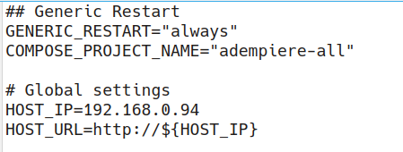

## Installation
### Requirements
##### 1 Install Tools
Make sure to install the following:
- JDK 17
- Docker
- Docker compose: [Docker Compose v2.16.0 or later](https://docs.docker.com/compose/install/linux/)
- Git

##### 2 Check versions
2.1 Check `java version`
```Shell
java --version
    openjdk 11.0.11 2021-04-20
    OpenJDK Runtime Environment AdoptOpenJDK-11.0.11+9 (build 11.0.11+9)
    OpenJDK 64-Bit Server VM AdoptOpenJDK-11.0.11+9 (build 11.0.11+9, mixed mode
```
2.2 Check `docker version`
```Shell
docker --version
    Docker version 23.0.3, build 3e7cbfd
```
2.3 Check `docker compose version`
```Shell
docker compose version
    Docker Compose version v2.17.2
```
### Clone This Repository
```Shell
git clone https://github.com/adempiere/adempiere-ui-gateway
cd adempiere-ui-gateway
```
### Make sure to use correct branch
```Shell
git checkout main
```

### Automatic Execution

##### 1 Execute With One Script
Execute script `start-all.sh [all, auth, cache, report, scheduler, storage, vue, zk]`:

```shell
cd adempiere-ui-gateway/docker-compose
```

- Default/Standard/All (`all`) profile/stack:
```shell
./start-all.sh
```
Or
```shell
./start-all.sh all
```

- Authentication (`auth`) profile/stack:
```shell
./start-all.sh auth
```

- Dictionary Cache (`cache`) profile/stack:
```shell
./start-all.sh cache
```

- Report Engine (`report`) profile/stack:
```shell
./start-all.sh -d report
```

- Processor Scheduler (`scheduler`) profile/stack:
```shell
./start-all.sh -d scheduler
```

- S3 Storage (`storage`) profile/stack:
```shell
./start-all.sh -d storage
```

- ADempiere-Vue UI (`vue`) profile/stack:
```shell
./start-all.sh -d vue
```

- ADempiere-Zk UI (`zk`) profile/stack:
```shell
./start-all.sh -d zk
```

The script `start-all.sh [parameter]` carries out the steps of the automatic installation.

Depending on the parameter -that BTW selects the profile- the script assembles the services out of file **docker-compose.yml** by including to the project only the services that have the profile set.

If no flag and/or parameter is given, the call will default to `docker compose -f docker-compose.yml` for the services combination **all**.
If directories `postgresql/postgres_database` and `postgresql/backups` do not exist, they are created.


##### 2 Result Of Script Execution
The docker compose project is executed with only services that have the profile given as parameter to the script `./start-all.sh`.

  Depending on the profile passed, certain services will be executed. Which docker compose service files are used depends on the purpose/mode: for example when testing Vue, the combination is different than for Authentication.

  All images are downloaded, containers and other docker objects created, containers are started, and -depending on conditions explained in the following section- database restored.

This might take some time, depending on your bandwith and the size of the restore file.
Once the image have been downloaded, the container creation and start will last less than without downloading.

##### 3 Cases When Database Will Be Restored
If
- there is a file *seed.backup* (or as defined in `env_template.env`, variable `POSTGRES_RESTORE_FILE_NAME`) in directory `postgresql/backups`, and
- the database as specified in `env_template.env`, variable `POSTGRES_DATABASE_NAME` does not exist in Postgres, and
- directory `postgresql/postgres_database` has no contents

*The database  will be restored*.

##### 4 Cases When Database Will Not Be Restored
The execution of `postgresql/initdb.sh` will be skipped if
- directory `postgresql/postgres_database` has contents, or
- in file `docker-compose.yml` there is a definition for *image*.
  Here, the Dockerfile is ignored and thus also `docker-compose.yml`.


### Manual Execution
Alternative to **Automatic Execution**.
Recommendable for the first installation.
##### 1 Create the directory on the host where the database will be mounted
```shell
mkdir postgresql/postgres_database
```
##### 2 Create the directory on the host where the backups will be mounted
```shell
mkdir postgresql/backups
```
##### 3 Copy backup file (if restore is needed)
- If you are executing this project for the first time or you want to restore the database, execute a database backup.
- First, go to the backups directory
  _cd .../adempiere-ui-gateway/docker-compose/postgresql/postgres_backups_
- Here you can run a backup directly from host using the _docker exec_ command
  _docker exec -i adempiere-ui-gateway.postgresql pg_dump --no-owner -h localhost -U postgres adempiere > adempiere-$(date '+%Y-%m-%d').backup_
- Or you can go into the container with _docker exec -it adempiere-ui-gateway.postgresql bash_ and execute there a backup e.g.: `cd /home/adempiere/postgres_backups` followed by `pg_dump -v --no-owner -h localhost -U postgres <DB-NAME> > adempiere-$(date '+%Y-%m-%d').backup`. Remember to first change directory to the shared directory between host and Postgres container.
- The file can have the name you wish, but if you want to execute a restore, it must be named `seed.backup` or as it was defined in *env_template.env*, variable `POSTGRES_RESTORE_FILE_NAME`.
  The backup file should be visible under `adempiere-ui-gateway/postgresql/backups`. You can copy it for safety reasons to other location e.g. the cloud.
- Make sure it is not the compressed backup (e.g. .jar).
- The database directory `adempiere-ui-gateway/docker-compose/postgresql/postgres_database` must be empty for the restore to ocurr.
  A backup will not ocurr if the database directory has contents.
```shell
cp <PATH-TO-BACKUP-FILE> postgresql/backups
```
##### 5 Modify env_template.env as needed
The only variables actually needed to change are
- `COMPOSE_PROJECT_NAME` -> to the name you want to give the project, e.g. the name of your client.
  From this name, all images and container names are derived.
- `HOST_IP` -> to to the IP your host has.
- `POSTGRES_IMAGE` -> to the Postgres version you want to use.
- `ADEMPIERE_GITHUB_VERSION` -> to the DB version needed.
- `ADEMPIERE_GITHUB_COMPRESSED_FILE` -> to the DB version needed.



Other values in *env_template.env* are default values.
Feel free to change them accordingly to your wishes/purposes.
There should be no need to change file `docker-compose.yml`.

##### 6 Copy env_template.env if it was modified
Once you modified *env_template.env* as needed, copy it to `.env`. This is not needed if you run `start-all.sh`.
```shell
cp env_template.env .env
```

##### 7 File initdb.sh (optional)
Modify `postgresql/initdb.sh` as necessary, depending on what you may want to do at database first start.
You may create roles, schemas, etc.

##### 8 Execute docker compose
Run `docker compose`
```shell
cd adempiere-ui-gateway/docker-compose
docker compose -f <filename> up -d
```

**Result: all images are downloaded, containers and other docker objects created, containers are started, and database restored**.

This might take some time, depending on your bandwith and the size of the restore file.

### Stop All Services That Were Started With Script start-all.sh
To stop all Docker containers that were started with script `start-all.sh`, just execute:
```Shell
cd adempiere-ui-gateway/docker-compose
./stop-all.sh
```
The file `docker-compose.yml` - created with script `start-all.sh` - contains the services tobe stopped.
The file `docker-compose.yml` is deleted after stopping all services.

### Delete All Docker Objects
Sometimes, due to different reasons, you need to undo everything you have created on Docker and start anew. This is mostly in development, not in production.
Then:
- All Docker containers must be shut down.
- All Docker containers must be deleted.
- All Docker images must be deleted.
- The Docker installation cache must be cleared.
- All Docker networks and volumes must be deleted.

Execute script:
```Shell
cd adempiere-ui-gateway/docker-compose
./stop-and-delete-all.sh
```
**Be very careful when using this script, because it will delete all Docker objects you have!**

### Database Access
Connect to database via port **55432** with a DB connector, e.g. PGAdmin.
Or to the port the variable `POSTGRES_EXTERNAL_PORT` points in file `env_template.env`.
It is recommendable to configure the PGAdmin access with ssh certification.

### PGAdmin Access with ssh certificate
First step: generate a ssh certificate for a host's user and deploy it on the host

PGAdmin Server Configuration
- Connection/Hostname: localhost
- Connection/Port: the port defined in file _env_template.env_ variable `POSTGRES_EXTERNAL_PORT`. Default is 55432
- Connection/Maintenance database: postgres
- Parameters/SSL Mode: [keyword: ssl] [Value: prefer]
- Parameters/Connection Timeout: e.g. 10 seconds
- SSH Tunnel/Use SSH Tunneling: Active
- SSH Tunnel/Tunnel Host: <IP where host is running ssh>
- SSH Tunnel/Tunnel Port: 22 (default; you can swith to another port if needed)
- SSH Tunnel/Username: <Username of host according to ssh certificate>
- SSH Tunnel/Authentication: Identity File
- SSH Tunnel/Identity File: <Path to ssh certificate>


[Back to README](../README.md) | [Previous: Profiles](./profiles.md) | [Next: Services](./services.md)
