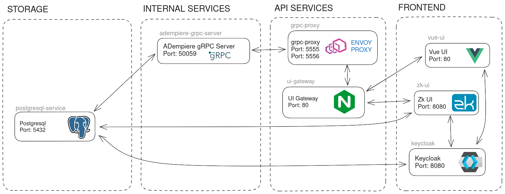
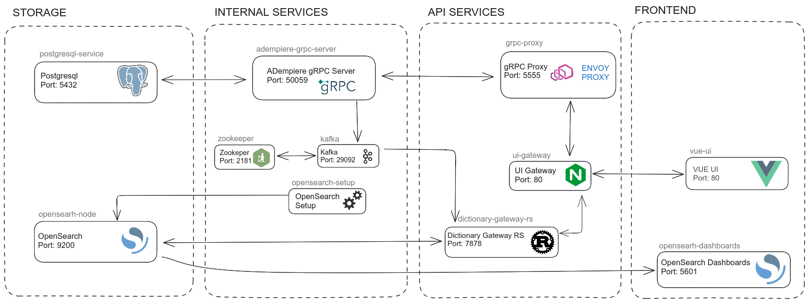
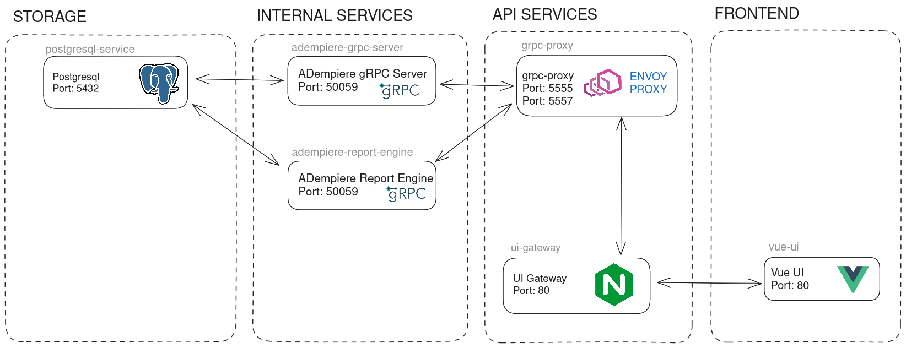
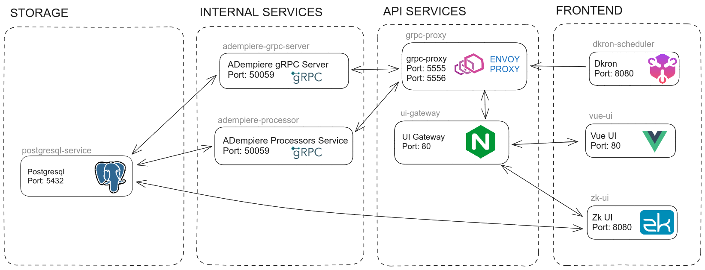
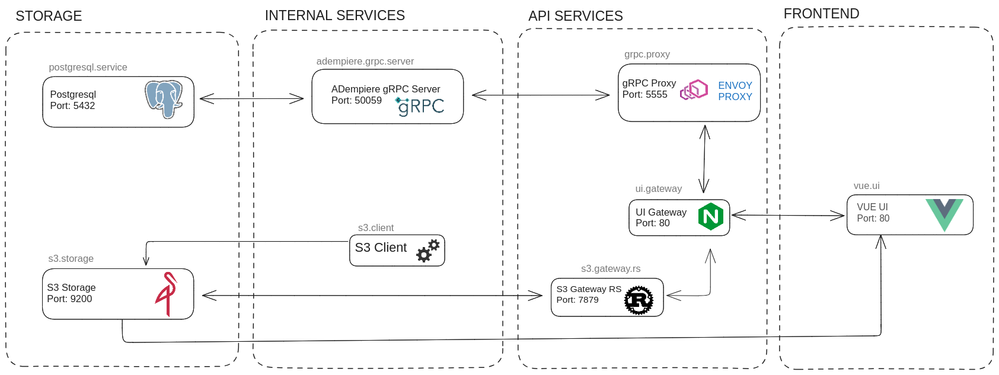
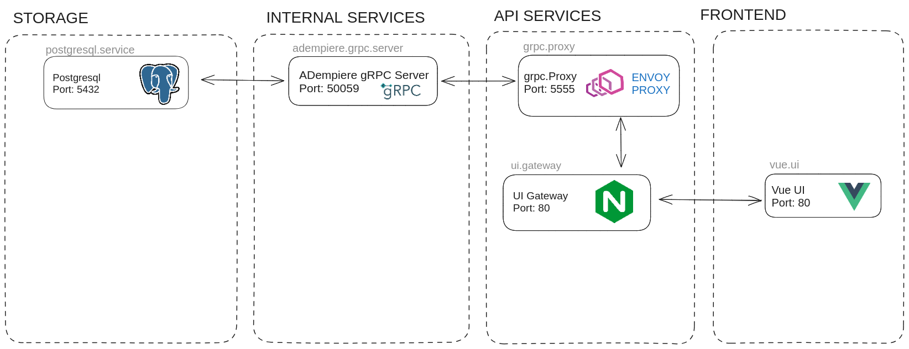
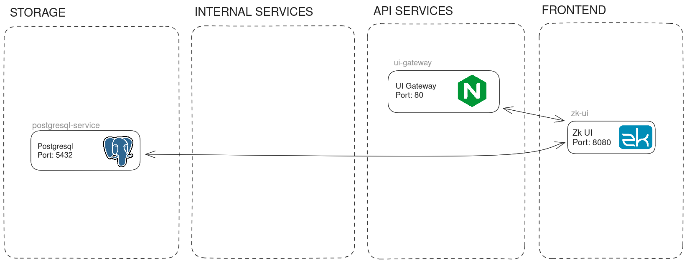

## Profiles
This application exploits the [Docker Compose Profiles](https://docs.docker.com/compose/how-tos/profiles/).

It basically defines a group of services that can be started or stopped together; this group is named a "profile".
In the file docker-compose.yml the profiles are defined for every service; this can be changed anytime accordingly to the needs.

By calling *docker compose up* or *./start-all.sh* plus a parameter, the parameter is interpreted as the profile to be used.

#### Services activated with _Default/Standard_ Profile (No parameter or empty string)
This is the **production-ready stack** with all core ADempiere services. This profile runs when you execute `./start-all.sh` without any parameter, or with `-d default`.

 - postgres-service
 - adempiere-site
 - adempiere-zk
 - vue-ui
 - vue-grpc-server
 - adempiere-grpc-server
 - grpc-proxy
 - ui-gateway


Start with:
```bash
./start-all.sh
```
Or:
```bash
./start-all.sh -d default
```

**Note:** This is the recommended stack for production deployments.


#### Services activated with _Authentication_ Profile
 - postgres-service
 - adempiere-zk
 - keycloak
 - adempiere-grpc-server
 - grpc-proxy
 - vue-ui
 - ui-gateway



Start with:
```bash
COMPOSE_PROFILES="auth" docker compose up
```


#### Services activated with _Dictionary Cache_ Profile
 - postgres-service
 - adempiere-grpc-server
 - grpc-proxy
 - zookeeper
 - kafka
 - opensearch-node
 - opensearch-setup
 - dictionary-rs
 - vue-ui
 - ui-gateway



Start with:
```bash
COMPOSE_PROFILES="cache" docker compose up
```


#### Services activated with _Dictionary Report Engine_ Profile
 - postgres-service
 - adempiere-grpc-server
 - adempiere-report-engine
 - grpc-proxy
 - vue-ui
 - ui-gateway



Start with:
```bash
COMPOSE_PROFILES="report" docker compose up
```


#### Services activated with _Processor Scheduler_ Profile
 - postgres-service
 - adempiere-zk
 - adempiere-processor
 - dkron-scheduler
 - adempiere-grpc-server
 - grpc-proxy
 - vue-ui
 - ui-gateway



Start with:
```bash
COMPOSE_PROFILES="scheduler" docker compose up
```


#### Services activated with _S3 Storage_ Profile
 - postgres-service
 - s3-storage
 - s3-client
 - s3-gateway-rs
 - adempiere-grpc-server
 - grpc-proxy
 - vue-ui
 - ui-gateway



Start with:
```bash
COMPOSE_PROFILES="storage" docker compose up
```


#### Services activated with _ADempiere-Vue UI_ Profile
 - postgres-service
 - adempiere-grpc-server
 - grpc-proxy
 - vue-ui
 - ui-gateway



Start with:
```bash
COMPOSE_PROFILES="vue" docker compose up
```


#### Services activated with _ADempiere-Zk UI_ Profile
 - postgres-service
 - zk
 - ui-gateway



Start with:
```bash
COMPOSE_PROFILES="zk" docker compose up
```


#### Services activated with _All_ Profile
The **all** profile activates the complete stack with ALL available services, including monitoring tools and optional components.

Start with:
```bash
./start-all.sh -d all
```
Or:
```bash
COMPOSE_PROFILES="all" docker compose up
```


#### Services activated with _Develop_ Profile
The **develop** profile includes additional development and monitoring tools with exposed ports for debugging. This is useful during development and testing.

Additional services compared to default:
 - Exposed database port (55432)
 - Kafdrop (Kafka monitoring)
 - OpenSearch Dashboards
 - Additional debug ports

Start with:
```bash
./start-all.sh -d develop
```


#### Multiple profiles
Profiles can be **combined** to activate services from different profiles. For example `report`, `vue` and `zk` combined profiles, activates the services of:

 - postgres-service
 - adempiere-grpc-server
 - adempiere-report-engine
 - grpc-proxy
 - vue-ui
 - zk
 - ui-gateway

Start with:
```bash
COMPOSE_PROFILES="report,vue,zk" docker compose up
```

**Note:** The default profile (empty string `''`) is always included unless you explicitly specify other profiles.

[Back to README](../README.md) | [Previous: Architecture](./architecture.md)  | [Next: Installation](./installation.md)
