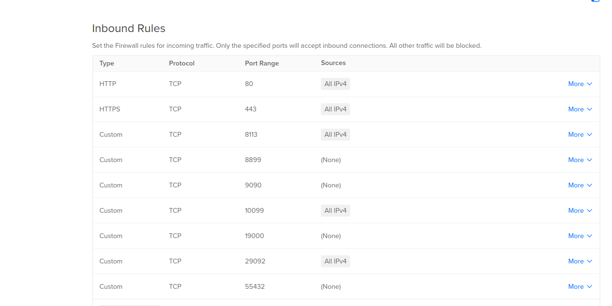

### Security Information
Please take the following explanations into consideration when implementing this solution.

This stack is based on Docker.
It is well known that Docker -because of its very nature- permits the direct access of its exposed ports, bypassing any firewall configuration set on the host.
Simply put: the firewall is useless.

This represents a danger as anybody can get access of any container via the exposed port.
Particularly dangerous is getting access to the Processors Service, where a processor can be defined and cause any harm.

How to avoid this? By creating a Firewall before the host where the stack is implemented and by not exposing the host to the internet.
Some brands like Azure, AWS or Digital Ocean offer a Firewall.

In the following image, an example how to configure a Firewall on Digital Ocean, where for example, the ssh/sftp port was directed to port 10099:

[Back to README](../README.md)| [Previous: Services](./services.md) | [Next: Debugging](./debugging.md)
