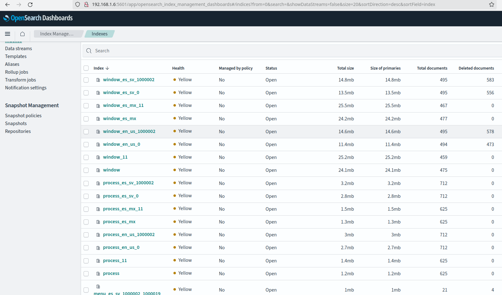
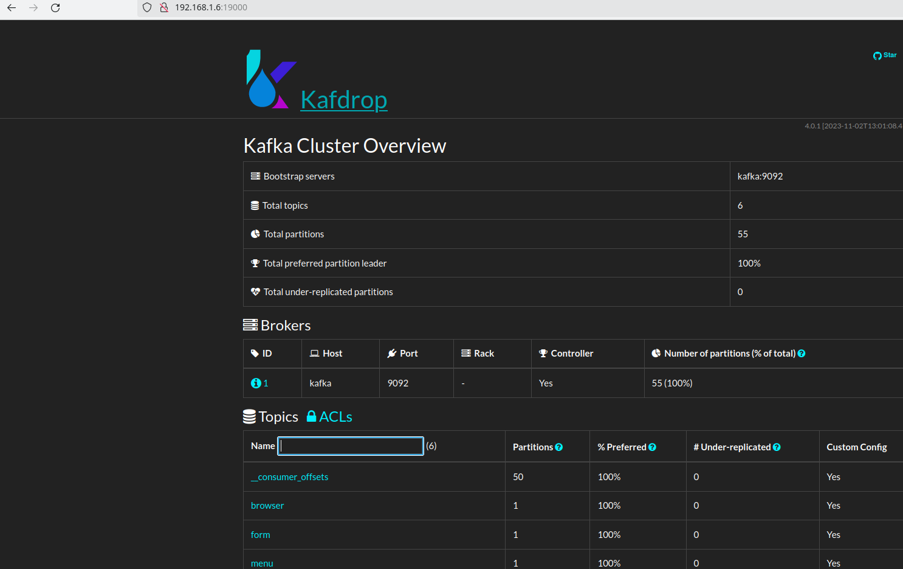
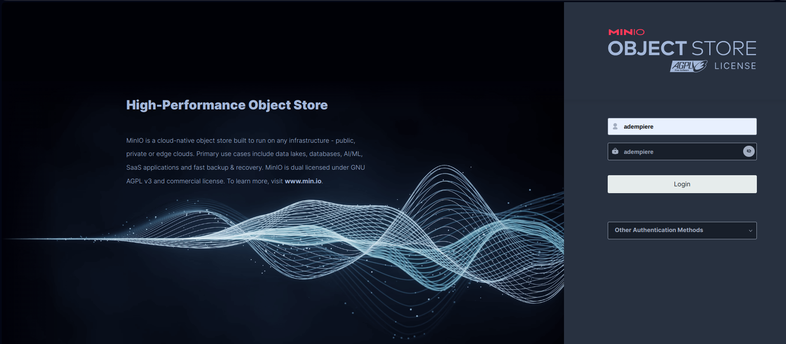
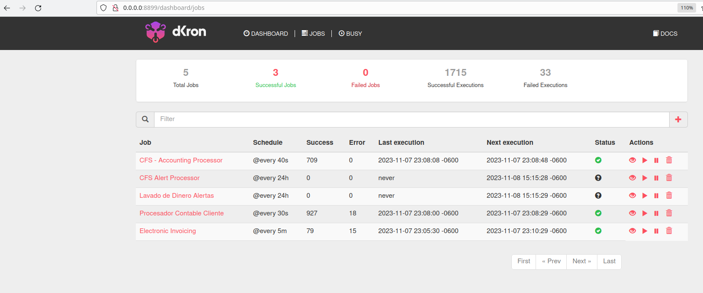

# Services Overview

This document describes all services available in the ADempiere UI Gateway stack, organized by category and stack profile.

## Table of Contents
- [Service Categories](#service-categories)
- [Infrastructure Services](#infrastructure-services)
- [Data & Messaging Services](#data--messaging-services)
- [Backend Services](#backend-services)
- [Proxy & Gateway Services](#proxy--gateway-services)
- [User Interface Services](#user-interface-services)
- [Monitoring & Management](#monitoring--management)
- [Optional Services](#optional-services)
- [Service Access Summary](#service-access-summary)
- [Stack Profiles](#stack-profiles)

---

## Service Categories

Services are organized into logical categories based on their role in the architecture:

1. **Infrastructure** - Database and core infrastructure
2. **Data & Messaging** - Search, caching, messaging, and storage
3. **Backend** - Business logic and API services
4. **Proxy & Gateway** - Request routing and API management
5. **User Interfaces** - Web UIs for users
6. **Monitoring** - Tools for monitoring and administration
7. **Optional** - Authentication and specialized services

For detailed architecture information including health checks and dependencies, see [Architecture Documentation](./architecture.md).

---

## Infrastructure Services

### PostgreSQL Database
- **Service Name:** `postgresql-service`
- **Container Name:** `adempiere-ui-gateway.postgresql`
- **Image:** `postgres:14.5`
- **Purpose:** Primary database for ADempiere ERP data
- **Profiles:** All (core service)
- **Access:**
  - **Internal:** `postgresql:5432` (container network)
  - **External (develop mode):** `${HOST_IP}:55432`
  - **Credentials:** postgres/postgres (default)
- **Data Persistence:** `postgresql/postgres_database/` (mounted volume)
- **Health Check:** 30s startup, 10s interval, 5s timeout
- **Documentation:** See [Backup and Restore Guide](./backup-restore.md)

### Zookeeper
- **Service Name:** `zookeeper-service`
- **Container Name:** `adempiere-ui-gateway.zookeeper`
- **Image:** `confluentinc/cp-zookeeper:7.6.1`
- **Purpose:** Coordination service for Kafka
- **Profiles:** All (required for Kafka)
- **Access:** `zookeeper:2181` (internal only)
- **Health Check:** 30s startup, 10s interval, 5s timeout

---

## Data & Messaging Services

### OpenSearch (Dictionary Cache)
- **Service Name:** `opensearch-service`
- **Container Name:** `adempiere-ui-gateway.opensearch`
- **Image:** `opensearchproject/opensearch:2.15.0`
- **Purpose:** Dictionary and metadata caching for fast lookups
- **Profiles:** `standard`, `develop`, `cache`
- **Access:** `opensearch:9200` (internal), `opensearch:9300` (cluster)
- **Web UI:** See OpenSearch Dashboards below
- **Health Check:** 90s startup, 30s interval, 10s timeout
- **Memory:** 2GB heap (JVM_HEAP_SIZE)

### OpenSearch Dashboards
- **Service Name:** `opensearch-dashboards`
- **Container Name:** `adempiere-ui-gateway.opensearch-dashboards`
- **Image:** `opensearchproject/opensearch-dashboards:2.15.0`
- **Purpose:** Web UI for OpenSearch cluster management
- **Profiles:** `develop`, `cache`
- **Access:** `http://${HOST_IP}:5601`
- **Default Credentials:** admin/admin
- **Health Check:** 90s startup, 30s interval, 10s timeout

### Kafka
- **Service Name:** `kafka-service`
- **Container Name:** `adempiere-ui-gateway.kafka`
- **Image:** `confluentinc/cp-kafka:7.6.1`
- **Purpose:** Message broker for asynchronous events
- **Profiles:** All (core messaging)
- **Access:** `kafka:9092` (internal)
- **Dependencies:** Requires Zookeeper
- **Health Check:** 60s startup, 30s interval, 10s timeout

### Kafdrop (Kafka Monitor)
- **Service Name:** `kafdrop-service`
- **Container Name:** `adempiere-ui-gateway.kafdrop`
- **Image:** `obsidiandynamics/kafdrop:4.0.1`
- **Purpose:** Web UI for Kafka topic monitoring and management
- **Profiles:** `standard`, `develop`
- **Access:** `http://${HOST_IP}:19000`
- **Dependencies:** Requires Kafka
- **Health Check:** 60s startup, 30s interval, 10s timeout

### MinIO S3 Storage
- **Service Name:** `s3-service`
- **Container Name:** `adempiere-ui-gateway.s3`
- **Image:** `quay.io/minio/minio:RELEASE.2025-07-23T15-54-02Z`
- **Purpose:** S3-compatible object storage for files and attachments
- **Profiles:** `standard`, `develop`, `storage`
- **Access:**
  - **API:** `http://${HOST_IP}:9000`
  - **Console:** `http://${HOST_IP}:9090`
- **Default Credentials:** minioadmin/minioadmin
- **Data Persistence:** `s3/data/` (mounted volume)
- **Health Check:** 30s startup, 30s interval, 5s timeout

---

## Backend Services

### gRPC Backend Server
- **Service Name:** `grpc-server-service`
- **Container Name:** `adempiere-ui-gateway.grpc-server`
- **Image:** `marcalwestf/adempiere-grpc-server:3.9.4.001-shw-1.0.34`
- **Purpose:** Core ADempiere business logic via gRPC API
- **Profiles:** All (core service)
- **Access:** `grpc-server:50059` (internal, via Envoy)
- **Dependencies:** PostgreSQL, OpenSearch, Kafka, S3
- **Health Check:** 120s startup, 30s interval, 10s timeout
- **Memory:** Java service (2-4GB recommended)

### Dictionary Service (Rust)
- **Service Name:** `dictionary-rs`
- **Container Name:** `adempiere-ui-gateway.dictionary-rs`
- **Image:** `ghcr.io/adempiere/dictionary-rs:1.6.5`
- **Purpose:** High-performance dictionary service written in Rust
- **Profiles:** All (core service)
- **Access:** `dictionary-rs:50051` (internal, via Envoy)
- **Dependencies:** PostgreSQL, OpenSearch
- **Health Check:** 90s startup, 30s interval, 10s timeout

### Processor Service
- **Service Name:** `adempiere-processor-service`
- **Container Name:** `adempiere-ui-gateway.processor`
- **Image:** `marcalwestf/adempiere-processors-service:alpine-1.1.18`
- **Purpose:** Background job execution and scheduled tasks
- **Profiles:** `standard`, `develop`
- **Access:** Internal only (no external ports)
- **Dependencies:** PostgreSQL, gRPC Server, Kafka
- **Health Check:** 120s startup, 30s interval, 10s timeout
- **Security Note:** Never expose this service externally (see [Security](./security.md))

---

## Proxy & Gateway Services

### Envoy gRPC Proxy
- **Service Name:** `envoy-proxy-service`
- **Container Name:** `adempiere-ui-gateway.envoy-grpc-proxy`
- **Image:** `envoyproxy/envoy:v1.37.0`
- **Purpose:** gRPC to HTTP/REST transcoding proxy
- **Profiles:** All (core service)
- **Access:** `envoy:8080` (internal, via nginx)
- **Dependencies:** gRPC Server, Dictionary Service
- **Health Check:** 30s startup, 30s interval, 10s timeout
- **Configuration:** `envoy/envoy.yaml`

### nginx API Gateway
- **Service Name:** `nginx-ui-gateway`
- **Container Name:** `adempiere-ui-gateway.nginx-ui-gateway`
- **Image:** `nginx:1.27.0-alpine3.19`
- **Purpose:** Reverse proxy and API gateway (single entry point)
- **Profiles:** All (core service)
- **Access:** `http://${HOST_IP}:80` (main entry point)
- **Routes:**
  - `/` → Landing page
  - `/webui` → ZK UI
  - `/vue` → Vue UI
  - `/api` → Envoy proxy (gRPC services)
  - Various monitoring tool routes
- **Dependencies:** All UI and backend services
- **Health Check:** 30s startup, 10s interval, 5s timeout
- **Configuration:** `nginx/nginx.conf`, `nginx/api_gateway.conf`

---

## User Interface Services

### Landing Page
- **Service Name:** `adempiere-site`
- **Container Name:** `adempiere-ui-gateway.site`
- **Image:** `ghcr.io/adempiere/adempiere-landing-page:alpine-1.0.4`
- **Purpose:** Welcome page with navigation to UIs
- **Profiles:** All (core service)
- **Access:** `http://${HOST_IP}/` (via nginx)
- **Health Check:** 30s startup, 10s interval, 5s timeout

### ADempiere ZK UI (Classic)
- **Service Name:** `adempiere-zk-service`
- **Container Name:** `adempiere-ui-gateway.zk`
- **Image:** `marcalwestf/adempiere-shw-zk:jetty-3.9.4.001-shw-1.1.48`
- **Purpose:** Traditional Java-based web UI (ZK framework)
- **Profiles:** `standard`, `develop`, `zk`
- **Access:** `http://${HOST_IP}/webui` (via nginx)
- **Dependencies:** gRPC Server, PostgreSQL
- **Health Check:** 120s startup, 30s interval, 10s timeout
- **Memory:** Java service (2-4GB recommended)
- **Data Persistence:** `postgresql/persistent_files/` (shared files)

### ADempiere Vue UI (Modern)
- **Service Name:** `adempiere-vue-service`
- **Container Name:** `adempiere-ui-gateway.vue`
- **Image:** `marcalwestf/adempiere-vue:0.0.8`
- **Purpose:** Modern Vue.js-based web UI
- **Profiles:** `vue`, `develop`
- **Access:** `http://${HOST_IP}/vue` (via nginx)
- **Dependencies:** Envoy proxy (gRPC services)
- **Health Check:** 60s startup, 30s interval, 10s timeout

---

## Monitoring & Management

### DKron Scheduler
- **Service Name:** `scheduler-dkron`
- **Container Name:** `adempiere-ui-gateway.scheduler-dkron`
- **Image:** `dkron/dkron:3.2.7`
- **Purpose:** Distributed job scheduler and monitor
- **Profiles:** `standard`, `develop`
- **Access:** `http://${HOST_IP}:8899`
- **Health Check:** 30s startup, 30s interval, 10s timeout
- **Use Cases:** Scheduled reports, data synchronization, cleanup tasks

---

## Optional Services

### Keycloak (Identity & Access Management)
- **Service Name:** `keycloak-service`
- **Container Name:** `adempiere-ui-gateway.keycloak`
- **Image:** `keycloak/keycloak:23.0.7`
- **Purpose:** Single Sign-On (SSO) and identity management
- **Profiles:** `auth` (optional authentication stack)
- **Access:** `http://${HOST_IP}:8080`
- **Default Credentials:** admin/admin
- **Dependencies:** PostgreSQL (separate database)
- **Health Check:** 90s startup, 30s interval, 10s timeout
- **Use Cases:** LDAP/AD integration, OAuth2, SAML, multi-tenant auth

---

## Service Access Summary

### Quick Access URLs

All services are accessed via the `HOST_IP` variable defined in `env_template.env`. Replace `${HOST_IP}` with your server's IP address or domain name.

| Service | URL | Default Port | Notes |
|---------|-----|--------------|-------|
| **Landing Page** | `http://${HOST_IP}/` | 80 | Main entry point |
| **ZK UI** | `http://${HOST_IP}/webui` | 80 | Classic interface |
| **Vue UI** | `http://${HOST_IP}/vue` | 80 | Modern interface |
| **gRPC API** | `http://${HOST_IP}/api` | 80 | REST/gRPC endpoints |
| **OpenSearch Dashboard** | `http://${HOST_IP}:5601` | 5601 | admin/admin |
| **Kafdrop (Kafka)** | `http://${HOST_IP}:19000` | 19000 | Kafka monitoring |
| **MinIO Console** | `http://${HOST_IP}:9090` | 9090 | minioadmin/minioadmin |
| **DKron Scheduler** | `http://${HOST_IP}:8899` | 8899 | Job scheduling |
| **Keycloak** | `http://${HOST_IP}:8080` | 8080 | admin/admin (auth profile) |
| **PostgreSQL** | `${HOST_IP}:55432` | 55432 | postgres/postgres (develop mode only) |

### Examples

If `HOST_IP=192.168.1.100`:
- Landing page: `http://192.168.1.100/`
- ZK UI: `http://192.168.1.100/webui`
- Kafdrop: `http://192.168.1.100:19000`

If `HOST_IP=erp.example.com`:
- Landing page: `http://erp.example.com/`
- Vue UI: `http://erp.example.com/vue`
- PostgreSQL: `erp.example.com:55432` (in PGAdmin)

---

## Stack Profiles

Different service combinations can be started using stack profiles. For complete details on starting stacks, see [Quick Start Guide](./quickstart.md).

### Default/Standard Profile
**Command:** `./start-all.sh` or `./start-all.sh -d default`

**Services included:**
- Infrastructure: PostgreSQL, Zookeeper
- Data & Messaging: OpenSearch, Kafka, Kafdrop, MinIO
- Backend: gRPC Server, Dictionary, Processor
- Proxy: Envoy, nginx
- UI: Landing page, ZK UI
- Monitoring: DKron

**Use case:** Production deployment with classic ZK interface

### Develop Profile
**Command:** `./start-all.sh -d develop`

**Additional services/features:**
- Exposes PostgreSQL on port 55432 for external access
- Includes OpenSearch Dashboards (port 5601)
- All monitoring tools enabled
- Additional debug ports exposed

**Use case:** Development and debugging

### Vue Profile
**Command:** `./start-all.sh -d vue`

**Services included:**
- Minimal backend services (PostgreSQL, gRPC, Dictionary, Envoy)
- Vue UI only (no ZK UI)
- No monitoring tools

**Use case:** Testing Vue interface with minimal resource usage

### Auth Profile
**Command:** `./start-all.sh -d auth`

**Additional services:**
- All standard services
- Keycloak identity management
- SSO configuration

**Use case:** Deployments requiring LDAP/AD integration or SSO

### Cache Profile
**Command:** `./start-all.sh -d cache`

**Services included:**
- PostgreSQL
- OpenSearch + Dashboards
- Dictionary service
- Minimal stack for testing dictionary cache

**Use case:** Testing and debugging OpenSearch dictionary caching

### Storage Profile
**Command:** `./start-all.sh -d storage`

**Services included:**
- PostgreSQL
- MinIO S3 storage
- gRPC Server
- Minimal stack for testing file storage

**Use case:** Testing and debugging S3 file operations

---

## Service Dependencies

For a detailed view of service dependencies and startup order, see the [Architecture Documentation](./architecture.md#service-dependencies).

**Quick reference:**
1. **Layer 1 (Infrastructure):** PostgreSQL, Zookeeper start first
2. **Layer 2 (Data):** OpenSearch, Kafka, S3 depend on Layer 1
3. **Layer 3 (Backend):** gRPC services depend on Layers 1 & 2
4. **Layer 4 (Gateway):** Envoy and nginx depend on all backend services
5. **Layer 5 (UI):** User interfaces start last, depend on gateway layer

---

## Troubleshooting

### Services Not Starting
- **Symptom:** Container exits immediately or fails health checks
- **Solution:** See [Troubleshooting Guide - Container Health Checks](./troubleshooting.md#container-health-checks-failing)
- **Common cause:** Java services (ZK, gRPC Server) need 60-120s to start

### Cannot Access Services
- **Symptom:** Connection refused or timeout when accessing URLs
- **Solutions:**
  1. Verify stack is running: `docker compose ps -a`
  2. Check nginx is healthy: `docker container logs adempiere-ui-gateway.nginx-ui-gateway`
  3. Verify `HOST_IP` in `env_template.env` matches your server
  4. Check firewall allows port 80 (and other exposed ports)
- **See:** [Troubleshooting Guide - Network Issues](./troubleshooting.md#network-and-access-issues)

### Database Connection Errors
- **Symptom:** Services log "connection refused" to PostgreSQL
- **Solutions:**
  1. Verify PostgreSQL is running: `docker container logs adempiere-ui-gateway.postgresql`
  2. Check database exists: `docker exec adempiere-ui-gateway.postgresql psql -U postgres -l`
  3. Force restore if needed: See [Backup and Restore](./backup-restore.md)
- **See:** [Troubleshooting Guide - Database Issues](./troubleshooting.md#database-issues)

### Performance Issues
- **Symptom:** Slow response times, timeouts
- **Solutions:**
  1. Check system resources: `docker stats`
  2. Verify minimum requirements: See [System Requirements](./system-requirements.md)
  3. Review Java heap sizes in `env_template.env`
- **See:** [Troubleshooting Guide - Performance](./troubleshooting.md#performance-issues)

---

## Additional Resources

- **[Architecture Documentation](./architecture.md)** - Detailed architecture, health checks, dependencies
- **[System Requirements](./system-requirements.md)** - Hardware/software requirements, resource planning
- **[Quick Start Guide](./quickstart.md)** - Getting started, basic operations
- **[Troubleshooting Guide](./troubleshooting.md)** - Common issues and solutions
- **[Backup and Restore](./backup-restore.md)** - Database backup/restore procedures
- **[Security Guide](./security.md)** - Security considerations and best practices
- **[Debugging Guide](./debugging.md)** - Advanced debugging commands

---

[Back to README](../README.md) | [Previous: Installation](./installation.md) | [Next: Security](./security.md)

